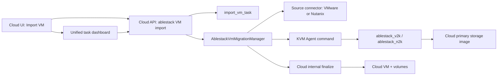

<!--
Licensed to the Apache Software Foundation (ASF) under one
or more contributor license agreements.  See the NOTICE file
distributed with this work for additional information
regarding copyright ownership.  The ASF licenses this file
to you under the Apache License, Version 2.0 (the
"License"); you may not use this file except in compliance
with the License.  You may obtain a copy of the License at

  http://www.apache.org/licenses/LICENSE-2.0

Unless required by applicable law or agreed to in writing,
software distributed under the License is distributed on an
"AS IS" BASIS, WITHOUT WARRANTIES OR CONDITIONS OF ANY
KIND, either express or implied.  See the License for the
specific language governing permissions and limitations
under the License.
-->
# ABLESTACK v2k/n2k Cloud Import Integration Design

## 1. 목표

이 작업의 목표는 가상머신 import의 시작, 진행 상태 확인, phase2 cutover, 최종 Cloud VM 생성까지를 Cloud UI/API 관점에서 통합하는 것이다.

현재 `ablestack-europa` 기준 Cloud에는 VMware -> KVM import와 `ablestack_v2k` phase1/phase2 흐름이 이미 들어와 있다. 그러나 이 구현은 v2k 전용 필드와 API에 강하게 묶여 있고, Nutanix -> KVM/Cloud 흐름인 `ablestack_n2k`는 Cloud UI/API에 아직 없다.

따라서 설계 원칙은 다음과 같다.

- 기존 `import_vm_task`와 `listImportVmTasks` 흐름을 유지해 UI/API 호환성을 보존한다.
- v2k 전용 모델을 generic Cloud migration task 모델로 확장한다.
- VMware/v2k와 Nutanix/n2k를 같은 task/status/finalize UI에서 다룬다.
- Cloud target 생성은 가능하면 Management Server 내부 서비스로 처리하고, Cloud API key/secret을 KVM host나 작업 디렉터리에 전달하지 않는다.
- Prism, vCenter, SSH, Cloud API secret은 DB/파일/manifest에 평문으로 저장하지 않는다. phase2 재사용이 필요한 source credential은 Cloud DB에 암호화해서 보관하고, 복호화는 Management Server의 task 실행 경로에서만 수행한다.

## 2. 현재 상태 요약

### UI

- 진입점은 `ui/src/views/tools/ManageInstances.vue`의 Tools > Manage Instances이다.
- VMware import는 `listVmwareDcVms`, `listVmwareDcs` API가 노출될 때만 보인다.
- `ui/src/views/tools/ImportUnmanagedInstance.vue`는 KVM cluster + VMware source일 때 `useablestackv2k` switch를 노출하고, 기본값을 true로 둔다.
- v2k mode에서는 `importUnmanagedInstanceForAblestackV2K`를 호출한다.
- `ui/src/views/tools/ImportVmTasks.vue`는 `listImportVmTasks` 결과를 보여주며, `v2kstep=Phase1_Completed` 또는 status상 phase1 완료이면 Phase2 버튼을 표시한다.

### API/Backend

- `ImportVmCmd`는 기존 `importVm` API이며 source는 `UNMANAGED`, `VMWARE`, `EXTERNAL`, `SHARED`, `LOCAL`이다.
- `ImportUnmanagedInstanceForAblestackV2KCmd`는 `split=phase1|phase2`, `importvmtaskid`를 추가한 v2k 전용 API이다.
- `UnmanagedVMsManagerImpl`은 v2k phase1에서 `AblestackV2KConvertInstanceCommand`를 KVM host에 보내고, phase2 완료 후 KVM unmanaged import 로직으로 최종 Cloud VM을 등록한다.
- `ImportVmTasksManagerImpl`은 `AblestackV2KStatusCommand`로 CLI 상태를 polling하고 `ImportVMTaskResponse`에 phase/state/step/workdir를 채운다.
- 현재 v2k Cloud storage 연동은 RBD 중심이다. `getAblestackV2KTargetFormat()`/`getAblestackV2KTargetStorage()`는 RBD와 SharedMountPoint만 분기하지만, `buildAblestackV2KTargetMapJson()`은 RBD에서만 target map을 만들고 다른 storage는 `null`을 반환한다. KVM wrapper도 target map을 RBD에서만 필수로 검사한다. 따라서 file 계열은 느슨한 best-effort이고, block/LVM/기타 primary storage는 현재 v2k Cloud 흐름에서 unsupported로 봐야 한다.

### DB

- `import_vm_task`는 legacy VMware import task에 v2k 필드가 덧붙은 형태이다.
- 현재 주요 v2k 확장 필드는 `v2k_step`, `cluster_id`, `service_offering_id`, `v2k_target_storage_pool_id`, `source_cluster_name`, `source_host_name`, `vcenter_id`, `vcenter_username`, `vcenter_password`, `service_offering_details`, `nic_network_map`이다.
- `vcenter_username`, `vcenter_password` 저장은 phase2 편의성은 있지만 secret hygiene 관점에서 개선 대상이다.

## 3. 목표 아키텍처



핵심은 Cloud가 migration lifecycle의 주체가 되는 것이다. 도구 CLI는 source disk sync와 상태 보고를 맡고, Cloud의 task/finalize/resource ownership은 Management Server가 책임진다.

## 4. DB 설계

### 4.1 기존 테이블 확장

기존 `import_vm_task`를 유지하고 다음 column을 추가한다. 기존 v2k column은 바로 제거하지 않고 하위 호환용으로 유지한다.

| Column | Type | 설명 |
| --- | --- | --- |
| `migration_tool` | `varchar(32)` | `legacy`, `ablestack_v2k`, `ablestack_n2k` |
| `source_provider` | `varchar(32)` | `vmware`, `nutanix`, `kvm`, `local`, `shared` |
| `target_provider` | `varchar(32)` | `cloud`, `kvm` |
| `target_profile` | `varchar(64)` | resolver가 결정한 `cloud-rbd`, `cloud-file`, `cloud-block`, `libvirt-*`, plugin profile |
| `target_storage_pool_id` | `bigint unsigned` | v2k/n2k 공통 target primary storage |
| `target_format` | `varchar(16)` | `raw`, `qcow2` |
| `target_storage_type` | `varchar(32)` | `rbd`, `file`, `block` |
| `target_vm_name` | `varchar(255)` | Cloud에 생성될 VM 이름 |
| `source_endpoint` | `varchar(255)` | vCenter 또는 Prism endpoint. secret 제외 |
| `source_ref` | `varchar(255)` | source VM uuid/name 등 provider별 안정 식별자 |
| `source_inventory_json` | `text` | source VM disk/NIC/OS 요약 snapshot |
| `source_context_json` | `text` | cluster/host/datacenter/container 등 비밀이 아닌 source context |
| `source_credential_id` | `bigint unsigned` | phase2/retry에서 재사용할 encrypted credential row |
| `target_context_json` | `text` | zone/network/storage/disk offering/target map 등 |
| `workdir` | `varchar(1024)` | tool workdir |
| `split_mode` | `varchar(16)` | requested split: `phase1`, `phase2`, `full` |
| `current_phase` | `varchar(32)` | `prepare`, `phase1`, `phase2`, `finalize`, `completed` |
| `migration_state` | `varchar(32)` | tool-level state: `pending`, `running`, `completed`, `failed` |
| `migration_step` | `varchar(255)` | tool-level current step |
| `cutover_policy` | `varchar(32)` | `guest`, `poweroff`, `manual`, `none` |
| `status_json` | `mediumtext` | latest normalized status payload |
| `error_code` | `varchar(64)` | failure classification |

권장 index:

- `(zone_id, migration_tool, state, created)`
- `(zone_id, source_provider, state, created)`
- `(uuid)`
- `(target_provider, current_phase, migration_state)`

### 4.2 Credential 저장 정책

phase2에서는 phase1 시작 시 입력한 credential을 재사용하는 것이 원칙이다. 따라서 external vCenter, Prism, source API credential은 DB에 저장하되 평문으로 저장하지 않고 task 전용 encrypted credential row로 분리한다.

`import_vm_task`에는 password나 secret 값을 직접 저장하지 않는다. 대신 `source_credential_id`만 저장한다.

```sql
CREATE TABLE `cloud`.`import_vm_task_credential` (
  `id` bigint unsigned NOT NULL auto_increment,
  `uuid` varchar(40) NOT NULL,
  `task_id` bigint unsigned NOT NULL,
  `provider` varchar(32) NOT NULL,
  `credential_type` varchar(32) NOT NULL,
  `username_hint` varchar(255),
  `encrypted_payload` mediumtext NOT NULL,
  `encryption_version` varchar(32) NOT NULL,
  `key_id` varchar(128),
  `created` datetime NOT NULL,
  `updated` datetime,
  `removed` datetime,
  PRIMARY KEY (`id`),
  INDEX `i_import_vm_task_credential__task_id` (`task_id`),
  CONSTRAINT `fk_import_vm_task_credential__task_id`
    FOREIGN KEY (`task_id`) REFERENCES `import_vm_task`(`id`) ON DELETE CASCADE
) ENGINE=InnoDB DEFAULT CHARSET=utf8;
```

`encrypted_payload`는 provider별 credential JSON을 Cloud management-server의 encryption service로 암호화한 값이다.

예시 payload:

```json
{
  "endpoint": "https://10.10.132.100:9440",
  "username": "admin",
  "password": "...",
  "sourceApi": "auto"
}
```

보안 규칙:

- `source_context_json`, `target_context_json`, `status_json`, task event payload, management log에는 secret 값을 쓰지 않는다.
- API command의 credential parameter는 sensitive parameter로 표시하고 request logging/redaction 대상에 포함한다.
- phase1 시작 시 credential을 검증한 뒤 encrypted credential row를 만들고, phase2/retry/finalize는 `source_credential_id`로 복호화해 사용한다.
- 복호화는 Management Server의 task execution path에서만 수행한다. UI/API response에는 credential 존재 여부와 `username_hint` 정도만 노출한다.
- KVM agent command에는 credential을 CLI argument로 직접 넣지 않는다. Wrapper가 `0600` 권한의 root-owned protected temp credential file을 만들고 `--cred-file`/`--cloud-cred-file` 류 옵션으로 전달한 뒤, 프로세스 종료/cleanup 시 제거한다. command log에는 temp path와 redacted value만 남긴다.
- task cleanup 또는 보존 기간 만료 시 encrypted credential row를 soft-delete/purge할 수 있어야 한다.

기존 v2k `vcenter_username`, `vcenter_password` column은 compatibility 때문에 즉시 삭제하지 않되 신규 generic path에서는 쓰지 않는다. 기존 registered vCenter처럼 Cloud가 이미 관리하는 credential 모델이 있는 경우에는 `source_context_json`에 `existingvcenterid`만 저장하고, 실제 credential 조회는 기존 DAO/credential owner 정책을 따른다.

### 4.3 Task event table

status polling 결과와 주요 전환을 추적하기 위해 별도 append-only table을 추가한다.

```sql
CREATE TABLE `cloud`.`import_vm_task_event` (
  `id` bigint unsigned NOT NULL auto_increment,
  `task_id` bigint unsigned NOT NULL,
  `event_type` varchar(64) NOT NULL,
  `phase` varchar(32),
  `state` varchar(32),
  `step` varchar(255),
  `message` text,
  `payload_json` mediumtext,
  `created` datetime NOT NULL,
  PRIMARY KEY (`id`),
  INDEX `i_import_vm_task_event__task_id_created` (`task_id`, `created`),
  CONSTRAINT `fk_import_vm_task_event__task_id`
    FOREIGN KEY (`task_id`) REFERENCES `import_vm_task`(`id`) ON DELETE CASCADE
) ENGINE=InnoDB DEFAULT CHARSET=utf8;
```

이 테이블은 UI detail drawer의 event timeline과 장애 분석에 사용한다.

## 5. API 설계

### 5.1 Compatibility API

기존 API는 유지한다.

- `importVm`
- `importUnmanagedInstanceForAblestackV2K`
- `listImportVmTasks`
- `listVmwareDcs`
- `listVmwareDcVms`

단, `importUnmanagedInstanceForAblestackV2K` 내부 구현은 새 generic manager로 위임한다.

### 5.2 Generic ablestack migration API

새 UI는 generic API를 우선 사용한다.

#### `listVmImportSources`

Cloud가 지원하는 source provider와 capability를 반환한다.

주요 response:

- `provider`: `vmware`, `nutanix`
- `tool`: `ablestack_v2k`, `ablestack_n2k`
- `supportsPhaseSplit`
- `supportsCloudTarget`
- `storesEncryptedCredentialForPhase2`
- `supportedStorageTypes`: installed tool와 Cloud storage resolver가 함께 지원하는 `rbd|file|block` 목록
- `available`: API/plugin/agent capability 기준 가능 여부

#### `listVmsForAblestackImport`

source VM inventory 조회용 API이다.

주요 request:

- `sourceprovider`: `VMWARE|NUTANIX`
- `zoneid`
- `existingvcenterid` 또는 `vcenter/datacentername/username/password`
- `prismendpoint`, `prismusername`, `prismpassword`, `sourceapi=auto|v4|v3|v2`
- `name`, `page`, `pagesize`

주요 response:

- `sourcevmid`
- `name`
- `powerstate`
- `osdisplayname`
- `clustername`
- `hostname`
- `disk[]`
- `nic[]`
- `sourcecapabilities`

VMware는 기존 `listVmwareDcVms` adapter를 재사용한다. Nutanix는 management server에서 직접 Prism API를 호출하거나, 선택된 KVM conversion host에 inventory command를 보내는 두 방법을 제공한다. 초기 구현은 agent command 방식이 CLI/runtime dependency와 맞다.

#### `preflightAblestackVmImport`

source VM과 Cloud target 계획을 검증한다.

검증 항목:

- source credential 접근 가능 여부
- selected VM disk/NIC inventory
- target cluster/host/tool 설치 여부
- target storage type과 format 매핑
- service offering custom details
- network mapping
- writeback disk offering 자동 선택 가능 여부
- phase1/full 가능 여부

#### `importVmForAblestackMigration`

v2k/n2k 공통 start/continue API이다.

주요 request:

- `tool`: `ABLESTACK_V2K|ABLESTACK_N2K`
- `sourceprovider`: `VMWARE|NUTANIX`
- `targetprovider`: `CLOUD`
- `split`: `phase1|phase2|full`
- `importvmtaskid`: phase2/retry/finalize continuation
- `zoneid`, `clusterid`
- `convertinstancehostid`
- `serviceofferingid`, custom `details`
- `targetstoragepoolid`
- `targetprofile`
- `name` 또는 `targetvmname`
- `nicnetworklist`, `nicipaddresslist`
- `datadiskofferinglist`
- source credential fields. phase1/full에서는 encrypted credential row를 생성하고 phase2/retry에서 재사용한다.
- `cutoverpolicy`: phase2/full에서 `guest|poweroff|manual|none`

response는 `ImportVMTaskResponse` 또는 async job의 job result로 task id를 반환한다. 기존 `UserVmResponse` 빈 응답보다 task 중심 응답이 Cloud UI에 더 자연스럽다.

#### `listImportVmTasks` 확장

추가 filter:

- `migrationtool`
- `sourceprovider`
- `targetprovider`
- `phase`
- `migrationstate`
- `sourcevmname`
- `includelegacy`

추가 response:

- `migrationtool`
- `sourceprovider`
- `targetprovider`
- `targetprofile`
- `targetvmname`
- `workdir`
- `currentphase`
- `migrationstate`
- `migrationstep`
- `cutoverpolicy`
- `credentialstate`: `available`, `missing`, `expired`, `purged`
- `credentialusernamehint`
- `availableactions[]`

#### `listImportVmTaskEvents`

Task detail timeline용 API이다.

Request:

- `importvmtaskid`
- `page`, `pagesize`

Response:

- event list from `import_vm_task_event`

#### Task action API

단일 action API 또는 action별 API를 둔다.

- `executeImportVmTaskAction`
  - `action=START_PHASE2|REFRESH_STATUS|FINALIZE|CLEANUP|CANCEL|RETRY`
  - `importvmtaskid`
  - `cutoverpolicy`
  - optional credential override fields only when the encrypted credential is missing, expired, or explicitly rotated

초기 구현은 `START_PHASE2`, `REFRESH_STATUS`, `CLEANUP`부터 넣는다. `CANCEL`은 tool-level cancel semantics가 확정된 뒤 구현한다.

## 6. Backend 설계

### 6.1 Manager 구조

새 manager를 추가한다.

```text
AblestackVmMigrationManager
  - preflight(...)
  - listSourceVms(...)
  - start(...)
  - continuePhase2(...)
  - refreshStatus(...)
  - finalizeTask(...)
  - cleanupTask(...)
```

Provider/adapter 분리:

```text
MigrationSourceAdapter
  - VMwareSourceAdapter
  - NutanixSourceAdapter

MigrationToolAdapter
  - AblestackV2KAdapter
  - AblestackN2KAdapter

MigrationTargetAdapter
  - CloudTargetAdapter
  - KvmTargetAdapter(optional compatibility)
```

기존 `UnmanagedVMsManagerImpl` 안에 있는 v2k 메서드는 새 manager로 점진 이동한다. 첫 구현에서는 기존 class 안에서 helper를 늘리되, 파일이 더 커지지 않도록 adapter class를 분리하는 것이 좋다.

### 6.2 Agent command

기존 v2k command와 wrapper는 유지하면서 generic command를 추가한다.

```text
AblestackVmMigrationCommand
  tool: ABLESTACK_V2K | ABLESTACK_N2K
  taskUuid
  vmName
  splitMode
  sourceProvider
  sourceEndpoint
  sourceCredential
  targetProvider
  targetStorageType
  targetFormat
  targetMapJson
  workdir
  optionsJson

AblestackVmMigrationStatusCommand
  tool
  vmName
  workdir

AblestackVmMigrationCleanupCommand
  tool
  vmName
  workdir
```

`sourceCredential`은 DB에 저장된 encrypted credential을 Management Server가 복호화한 runtime-only 값이다. 이 객체는 API response, task event, agent command `toString()`, management log에 직접 출력하지 않는다. Wrapper는 CLI 실행 직전에 protected temp credential file과 redacted command builder를 사용하고, 실행 후 temp file을 제거한다.

KVM wrapper는 tool별 CLI를 호출한다.

v2k:

```bash
ablestack_v2k run \
  --vm <vm> \
  --vcenter <endpoint> \
  --split <phase1|phase2|full> \
  --target-format <raw|qcow2> \
  --target-storage <rbd|file|block> \
  --target-map-json <json>
```

n2k:

```bash
ablestack_n2k \
  --workdir <workdir> \
  run \
  --pc <endpoint> \
  --vm <vm> \
  --split <phase1|phase2|full> \
  --target-provider cloud-managed \
  --target-format <raw|qcow2> \
  --target-storage <rbd|file|block> \
  --target-map-json <json>
```

`cloud-managed`는 Cloud가 최종 VM 생성을 직접 수행한다는 의미의 신규/정렬 대상이다. qemu-exec-tools가 당장 이 옵션을 갖지 않는다면 초기에는 `--apply` 없는 disk-sync mode 또는 libvirt/file target mode를 사용하고, Cloud backend가 importVolume/deploy step을 수행한다.

### 6.3 Status normalization

v2k와 n2k의 status 출력은 서로 다르므로 backend는 다음 normalized model로 통일한다.

```json
{
  "phase": "phase1",
  "state": "running",
  "step": "sync",
  "progress": {
    "percent": 71,
    "currentDisk": "scsi0:0",
    "bytesCopied": 1234,
    "bytesTotal": 5678
  },
  "workdir": "/var/lib/ablestack-n2k/rhel/20260520-120944-writeback",
  "resumePlan": "run --split phase2",
  "finalizeReady": false,
  "message": "..."
}
```

이 model을 `status_json`에 저장하고, 기존 response 필드인 `phase`, `migrationstate`, `migrationstep`, `workdir`에도 projection한다.

### 6.4 Cloud target finalize

v2k 현행 방식:

1. v2k가 KVM domain/disk를 준비한다.
2. Cloud가 unmanaged KVM VM import로 최종 VM을 등록한다.

개선 설계:

- v2k도 target storage map을 Cloud primary storage 기준으로 만들고, finalize는 `importUnmanagedInstance` 재사용 또는 volume import path를 선택한다.
- RBD/file/block storage의 target path naming과 volume reservation은 Cloud가 task 생성 시 확정해 tool에 전달한다.

n2k 권장 방식:

1. Cloud가 선택된 primary storage type을 해석해 target disk plan을 만든다.
2. block/LVM 계열이면 phase1 전에 Cloud volume 또는 block target을 예약하고, file/RBD 계열이면 target image name/path를 예약한다.
3. phase1/phase2 동안 n2k는 예약된 Cloud primary storage target에 root/data disk를 동기화한다.
4. phase2 완료 후 Management Server가 내부 service로 volume import 또는 reserved volume association을 수행한다.
5. root volume 기반 VM 생성 API/service를 호출한다.
6. data disk를 attach한다.
7. VM start policy에 따라 start한다.

Cloud API key/secret을 KVM host에 전달하지 않는 것이 핵심이다.

### 6.5 Target storage resolver

UI는 제한된 target profile을 수동으로 고르게 하지 않고, 사용자가 선택한 Cloud primary storage를 기준으로 target plan을 자동 생성한다. 이 resolver는 installed `ablestack_v2k`/`ablestack_n2k` capability와 Cloud primary storage type을 함께 보고 `target_storage_type`, `target_format`, `target_map_json`, finalize strategy를 결정한다.

지원 원칙:

- v2k/n2k가 지원하는 모든 storage mode를 Cloud storage resolver에 등록한다.
- 특정 tool version 또는 Cloud storage plugin이 아직 어떤 mode를 지원하지 않으면 UI를 숨기지 않고 preflight에서 명확한 unsupported reason을 반환한다.
- 사용자가 기본 스토리지만 선택하면 resolver가 맞는 format/path/map/finalize strategy를 자동으로 채운다. Advanced override는 디버깅/검증 목적에만 둔다.

Cloud target plan:

| Cloud primary storage | Tool storage | Format | Tool target | Finalize strategy |
| --- | --- | --- | --- | --- |
| RBD | `rbd` | `raw` | `rbd:<pool>/<image>` | `importVolume` 또는 RBD volume association |
| SharedMountPoint / Filesystem / NetworkFilesystem | `file` | `qcow2` | `<pool.path>/<image>.qcow2` | file-backed volume import |
| LVM / CLVM / block primary storage | `block` | `raw` | reserved block device path or device mapper path | pre-created/reserved volume association |
| Host-local file storage | `file` | `qcow2` 또는 `raw` | selected host local pool path | host-pinned unmanaged import/finalize |
| Plugin-provided storage | resolver capability | resolver capability | resolver-generated map | plugin-specific finalize adapter |

Resolver output:

```json
{
  "targetProfile": "cloud-rbd",
  "targetStorageType": "rbd",
  "targetFormat": "raw",
  "targetMapJson": {
    "scsi0:0": "rbd:rbd/ablestack-n2k-<task>-root",
    "scsi0:1": "rbd:rbd/ablestack-n2k-<task>-data1"
  },
  "finalizeStrategy": "IMPORT_VOLUME",
  "requiresPrecreatedVolume": false,
  "hostAffinityRequired": false
}
```

Block/LVM output는 `requiresPrecreatedVolume=true`가 되며, phase1 전에 Cloud가 volume/device를 준비한다. file/RBD output는 image/path reservation만 필요하다.

Naming:

```text
<tool>-<task-short-uuid>-<source-vm-safe-name>-root
<tool>-<task-short-uuid>-<source-vm-safe-name>-data<N>
```

이름은 task 생성 시 DB에 저장하고 phase2/finalize까지 변경하지 않는다.

### 6.6 v2k Cloud storage 개선

현행 v2k 구현은 RBD Cloud target에 맞춰진 부분이 많으므로, generic resolver 적용 전에 v2k adapter를 다음처럼 개선한다.

현재 코드상의 제한:

- RBD만 `targetMapJson`을 생성한다.
- SharedMountPoint는 `target-storage=file`, `target-format=qcow2`까지는 내려가지만 disk별 target path/map이 Cloud task에 안정적으로 기록되지 않는다.
- `getAblestackV2KTargetFormat()`과 `getAblestackV2KTargetStorage()`는 RBD/SharedMountPoint 외 primary storage를 unsupported 처리한다.
- wrapper의 `--dst`는 RBD일 때 `/var/lib/libvirt/images/<vm>`으로 고정되고, file일 때 storage pool local path만 사용한다.
- block/LVM target reservation, pre-created volume association, Cloud finalize strategy가 없다.

개선 방향:

1. v2k도 n2k와 같은 `TargetStorageResolver` output을 사용한다.
2. RBD/file/block 모두 disk별 `targetMapJson` 또는 equivalent target manifest를 생성한다.
3. SharedMountPoint/Filesystem/NetworkFilesystem은 Cloud storage pool `path`를 기준으로 root-level qcow2 target path를 확정한다.
4. Host-local file storage는 selected conversion/import host affinity를 강제하고, task context에 host affinity를 저장한다.
5. LVM/block storage는 phase1 전에 Cloud가 target volume/block device를 예약하고, v2k에는 device path map을 넘긴다.
6. v2k wrapper는 `rbd`만 특별취급하지 않고 resolver가 준 `targetStorageType`, `targetFormat`, `targetMapJson`, `dst`를 그대로 사용한다.
7. phase2 완료 후 finalize는 storage별 strategy를 사용한다.
   - RBD/file: volume import 또는 unmanaged import
   - block/LVM: pre-created/reserved volume association
   - host-local: host-pinned unmanaged import
8. UI preflight는 현재 installed v2k version이 특정 storage mode를 지원하지 않으면 `unsupported by ablestack_v2k runtime` reason을 보여준다.

v2k storage 개선은 n2k 추가보다 먼저 또는 동시에 진행해야 한다. 그렇지 않으면 UI가 "기본 스토리지를 선택하면 자동 대응"한다고 보여주면서 v2k는 사실상 RBD에서만 안정 동작하는 상태가 된다.

### 6.7 Disk offering/writeback

n2k/v2k Cloud target은 writeback disk offering을 자동 선택한다.

- shared storage: `N2K Migration Writeback` 또는 `V2K Migration Writeback`
- local storage: `N2K Migration Writeback Local` 또는 `V2K Migration Writeback Local`
- 필수 조건: `customized=true`, no tags, `cachemode=writeback`

공통 helper를 둔다.

```text
resolveMigrationWritebackDiskOffering(tool, storageScope, account, zone)
```

동일 이름의 incompatible offering이 있으면 preflight에서 실패시킨다.

## 7. UI 설계

### 7.0 UI 공통 원칙

새 v2k/n2k import UI는 기존 Cloud UI의 룩앤필을 최대한 준용한다. 별도 디자인 시스템이나 독립적인 visual language를 만들지 않고, 현재 `ManageInstances.vue`, `ImportUnmanagedInstance.vue`, `ImportVmTasks.vue`가 사용하는 Ant Design Vue component, form layout, table, card, modal, drawer, notification, pagination, status 표현 방식을 재사용한다.

구현 원칙:

- 기존 Tools > Manage Instances 화면의 정보 밀도와 흐름을 유지한다.
- 새 source 선택, target resolver preview, task detail drawer는 기존 form/table/card 스타일 위에 얹는다.
- 색상, border, spacing, font size는 전역 theme token과 기존 class를 우선 사용하고, component-local CSS는 필요한 경우에만 최소화한다.
- inline hard-coded color를 피하고, light/dark mode에서 모두 읽히는 token 또는 CSS variable을 사용한다.
- 상태 badge, progress, warning, error, disabled reason은 기존 `Status`, Ant Design status color, notification 패턴을 따른다.
- 다국어 지원을 위해 UI 문구는 모두 locale key로 분리한다. template/script에 영문/한글 문구를 직접 박지 않는다.
- API에서 내려오는 machine state는 UI에서 locale key로 mapping한다. 예: `Phase1_Completed` -> `label.migration.phase1.completed`.
- 긴 한글/영문/식별자/경로가 table cell, button, drawer 안에서 깨지지 않도록 responsive wrapping, ellipsis, tooltip을 적용한다.
- light/dark mode 모두에서 wizard, table, drawer, modal, preflight warning, credential status, storage resolver preview를 확인한다.

Locale 파일:

- `ui/public/locales/en.json`
- `ui/public/locales/ko_KR.json`

신규 key는 `label.migration.*`, `message.migration.*`, `error.migration.*` prefix를 우선 사용한다. 기존 `label.import.vm.tasks`, `label.phase2.execute`처럼 이미 있는 key는 재사용한다.

### 7.1 진입점

기존 Manage Instances 화면을 유지하되 source action을 재구성한다.

- Existing unmanaged VM
- VMware via ABLESTACK V2K
- Nutanix via ABLESTACK N2K
- External KVM
- Local disk
- Shared disk

VMware/Nutanix는 일반 "VM Import" 안에서 source provider tab 또는 segmented control로 고른다.

### 7.2 Wizard 단계

1. Source
   - VMware: existing vCenter 또는 external vCenter
   - Nutanix: Prism Central/Element endpoint, source API `auto|v4|v3`, credential input
   - Source VM list

2. Target Cloud
   - Zone, cluster, conversion host
   - Primary storage
   - Auto-resolved target plan: `cloud-rbd`, `cloud-file`, `cloud-block`, plugin-specific profile
   - Tool storage/format preview: `rbd/raw`, `file/qcow2`, `block/raw` 등
   - Service offering/custom details
   - Target VM name

3. Network and Disk
   - NIC -> Cloud network mapping
   - Optional static IP
   - Disk offering/writeback result preview
   - Disk target path preview

4. Run mode
   - `phase1`, `full`
   - For phase2 only task dashboard action에서 실행
   - Cutover policy is disabled in phase1, required in phase2/full

5. Review and Start
   - Preflight result
   - Submit

### 7.3 Task dashboard

`ImportVmTasks.vue`를 generic task dashboard로 확장하거나 새 `VmMigrationTasks.vue`로 분리한다.

Columns:

- Created
- Tool
- Source provider
- Source VM
- Target VM
- Phase
- State
- Step
- Progress
- Conversion host
- Workdir
- Actions

Actions:

- Refresh
- Start Phase2
- Finalize
- Retry status
- Cleanup
- Open VM

Phase2 action은 다음 조건에서만 노출한다.

- `migration_tool in (ablestack_v2k, ablestack_n2k)`
- `current_phase=phase1`
- `migration_state=completed`
- `vm_id is null`
- target context가 유효함
- encrypted credential이 `available` 상태임

Phase2 modal은 기본적으로 credential을 다시 받지 않는다. 대신 phase1에서 암호화 저장된 credential을 재사용한다. UI는 `credentialstate=available`과 `credentialusernamehint`를 표시하고, credential이 `missing`, `expired`, `purged`이거나 운영자가 명시적으로 교체할 때만 credential override 입력을 연다.

### 7.4 Task detail drawer

Task row 클릭 시 drawer를 연다.

Sections:

- Summary
- Source
- Target plan
- Disk map
- Network map
- Latest status
- Event timeline
- Error detail

secret 값은 표시하지 않는다.

### 7.5 Permission/API gating

UI는 `listVmImportSources` 또는 `listApis` 결과로 기능을 켠다.

- VMware/v2k: `listVmwareDcVms`, `importVmForAblestackMigration` 또는 compatibility v2k API
- Nutanix/n2k: `listVmsForAblestackImport`, `importVmForAblestackMigration`, KVM agent capability

n2k CLI 미설치 또는 agent wrapper 미지원이면 Nutanix source action을 disabled 상태로 표시하고 preflight에서 원인을 보여준다.

## 8. 소스코드 작성 단계

총 9단계로 나누어 진행한다. 각 단계는 가능하면 독립 commit 또는 작은 PR 단위로 끝낼 수 있게 만든다. 앞 단계의 schema/API contract가 뒤 단계의 UI와 runtime 구현을 받쳐야 하므로, DB/API 기반을 먼저 고정하고 v2k 개선, n2k 추가, UI 통합 순서로 진행한다.

### 1단계: DB schema와 domain model 기반

목표:

- `import_vm_task`를 generic migration task로 확장한다.
- task event와 encrypted credential 저장소의 DB 기반을 만든다.

주요 작업:

- `import_vm_task` generic column 추가
- `import_vm_task_event` table 추가
- `import_vm_task_credential` table 추가
- `ImportVMTaskVO`, `ImportVmTask`, DAO, schema migration 정리
- fresh install과 Europa upgrade 모두 idempotent하게 통과하도록 schema 파일 정리

완료 기준:

- DB migration SQL이 중복 실행 가능해야 한다.
- 기존 legacy/v2k task row가 깨지지 않아야 한다.
- DAO 단위 테스트 또는 최소 schema/VO compile 검증을 통과해야 한다.

### 2단계: encrypted credential과 redaction

목표:

- phase1에서 입력한 credential을 암호화 저장하고 phase2/retry/finalize에서 재사용한다.
- request/log/response/task event에 secret이 남지 않도록 한다.

주요 작업:

- `ImportVmTaskCredentialVO`와 DAO 추가
- Management Server encryption service 기반 encrypt/decrypt helper 추가
- vCenter/Prism credential payload 저장/조회 API 내부 helper 추가
- API parameter sensitive marking과 logging redaction 정리
- agent command `toString()`/log redaction 점검
- protected temp credential file 생성/삭제 helper 설계 반영

완료 기준:

- phase2 API 호출 시 credential 재입력 없이 task credential을 복호화해 사용할 수 있어야 한다.
- UI/API response와 management log에 password/secret 원문이 없어야 한다.
- credential row cleanup/soft-delete 경로가 있어야 한다.

### 3단계: task API, response, event/status 공통화

목표:

- v2k/n2k가 공통 task API와 response model 위에서 동작할 수 있게 한다.

주요 작업:

- `ImportVMTaskResponse`에 `migrationtool`, `sourceprovider`, `targetprovider`, `targetprofile`, `targetvmname`, `workdir`, `currentphase`, `migrationstate`, `migrationstep`, `credentialstate`, `availableactions` 추가
- `listImportVmTasks` filter 확장
- `listImportVmTaskEvents` 추가
- `executeImportVmTaskAction` 또는 action별 API skeleton 추가
- status normalization model과 event append helper 추가

완료 기준:

- 기존 `listImportVmTasks` UI/API 호출은 하위 호환되어야 한다.
- 신규 filter와 response field가 API discovery에 노출되어야 한다.
- task event timeline을 API로 조회할 수 있어야 한다.

### 4단계: TargetStorageResolver와 v2k storage 개선

목표:

- 현재 RBD 중심인 v2k Cloud storage coupling을 제거한다.
- 사용자가 기본 primary storage를 선택하면 RBD/file/block에 맞는 target plan이 자동 생성되도록 한다.

주요 작업:

- `AblestackV2KTargetStorageResolver`와 `AblestackV2KTargetStoragePlan` 추가
- RBD/raw, SharedMountPoint/Filesystem/NetworkFilesystem file/qcow2 target plan 생성
- v2k `getAblestackV2KTargetFormat()`, `getAblestackV2KTargetStorage()`, `buildAblestackV2KTargetMapJson()`을 resolver 기반으로 재정리
- v2k wrapper가 resolver의 `dst`, `targetStorageType`, `targetFormat`, `targetMapJson`을 그대로 사용하도록 개선
- NetworkFilesystem처럼 Management Server의 storage path와 KVM host local mount path가 다를 수 있는 file storage는 agent-side storage pool local path를 fallback으로 사용
- block/LVM/Iscsi/PowerFlex/Linstor/StorPool/FiberChannel 계열은 v2k의 `block/raw` target으로 분류하되, Cloud phase1에서 안전한 per-disk block device reservation map을 만들 수 없으면 명확한 preflight 실패 사유를 반환
- block 계열의 실제 Cloud volume/device reservation 흐름은 별도 reservation contract가 준비된 뒤 활성화
- unsupported storage는 preflight reason으로 반환

완료 기준:

- v2k RBD/raw 기존 동작이 유지되어야 한다.
- v2k SharedMountPoint/Filesystem/NetworkFilesystem qcow2 target path가 task context에 안정적으로 남아야 한다.
- block/raw는 잘못된 device path를 추정하지 않고 resolver/preflight 단계에서 안전하게 중단되어야 한다.

진행 상태:

- 구현됨: RBD/raw target map, file/qcow2 target plan, agent-side destination fallback, task context 저장, v2k command parameter 전달
- 구현됨: block 계열 storage type 감지와 안전한 preflight 실패 처리
- 보류: block 계열 실제 Cloud volume/device reservation map 생성과 활성화

### 5단계: generic migration manager와 v2k 호환 API 이관

목표:

- 기존 v2k 전용 구현을 generic manager 위로 올려 이후 n2k와 UI가 같은 흐름을 쓰게 한다.

주요 작업:

- `AblestackVmMigrationManager` 추가
- `MigrationSourceAdapter`, `MigrationToolAdapter`, `MigrationTargetAdapter` interface 추가
- `AblestackV2KAdapter` 추가
- 기존 `importUnmanagedInstanceForAblestackV2K`가 generic manager를 호출하도록 변경
- v2k phase1/phase2/status/finalize가 신규 task/status/event/credential/storage resolver를 사용하도록 이관

완료 기준:

- 기존 v2k UI에서 phase1/phase2가 계속 동작해야 한다.
- 기존 compatibility API response와 async job behavior가 깨지지 않아야 한다.
- 신규 task response field에도 v2k 상태가 채워져야 한다.

진행 상태:

- 구현됨: `AblestackVmMigrationManager`, generic migration request, source/tool/target adapter interface skeleton
- 구현됨: `AblestackV2KAdapter` 추가 및 기존 `importUnmanagedInstanceForAblestackV2K` compatibility API의 generic manager 위임
- 유지됨: v2k phase1/phase2 실행, credential 재사용, task event/status, target storage resolver, finalize 경로
- 보류: source/target adapter의 실제 preflight 구현과 n2k adapter 등록은 6-7단계에서 진행

### 6단계: n2k source inventory와 preflight

목표:

- Cloud UI/API에서 Nutanix source VM을 조회하고 target 계획을 사전 검증할 수 있게 한다.

주요 작업:

- `NutanixSourceAdapter` 추가
- Prism endpoint/API version/credential handling 추가
- `listVmsForAblestackImport`의 Nutanix path 추가
- `preflightAblestackVmImport` Nutanix/n2k 검증 추가
- source VM disk/NIC inventory를 `source_inventory_json`에 저장 가능한 normalized model로 변환

완료 기준:

- Prism source VM 목록과 VM detail이 Cloud API response로 조회되어야 한다.
- credential은 encrypted credential flow와 연결되어야 한다.
- n2k CLI/agent 미설치, API fallback 불가, target storage 미지원 같은 실패가 preflight reason으로 표현되어야 한다.

진행 상태:

- 구현됨: `NutanixSourceAdapter`가 Prism v4 -> v3 -> v2 순서로 VM inventory를 조회하고 `UnmanagedInstanceTO`로 정규화
- 구현됨: `listVmsForImport`에 `sourceprovider=nutanix`, `sourceapi=auto|v4|v3|v2`, `insecure` 파라미터 추가
- 구현됨: `preflightAblestackVmImport` API와 `AblestackVmImportPreflightResponse` 추가
- 구현됨: n2k Cloud target preflight에서 RBD/raw, file/qcow2 storage plan 검증 및 unsupported storage reason 반환
- 구현됨: phase1 시작 시 Nutanix credential을 encrypted credential flow에 저장하고 `source_inventory_json` snapshot을 task context에 저장

### 7단계: n2k runtime, status, finalize

목표:

- n2k phase1/full/phase2를 Cloud task lifecycle에 연결하고 최종 Cloud VM 생성까지 마무리한다.

주요 작업:

- `AblestackN2KConvertInstanceCommand`, status, cleanup command 추가
- KVM wrapper에서 `ablestack_n2k` 실행, status parsing, cleanup 구현
- n2k target plan을 RBD/file/block resolver와 연결
- n2k phase1/full start
- n2k phase2 action
- phase2 완료 후 Cloud internal finalize: volume import/reserved volume association, VM 생성, data disk attach, start policy

완료 기준:

- n2k task가 `phase1 -> Phase2 가능 -> phase2 -> finalize -> Completed`로 전환되어야 한다.
- status polling 결과가 normalized response와 event timeline에 반영되어야 한다.
- 22.x RBD와 1.x SharedMountPoint target 모두 설계상 같은 API 흐름을 사용해야 한다.

진행 상태:

- 구현됨: `importUnmanagedInstanceForAblestackN2K` API command 추가
- 구현됨: generic migration manager에 `AblestackN2KAdapter` 등록
- 구현됨: `AblestackN2KConvertInstanceCommand`, `AblestackN2KStatusCommand`, `AblestackN2KCleanupCommand`와 answer model 추가
- 구현됨: KVM wrapper에서 `ablestack_n2k --workdir ... run/status/cleanup` 실행
- 구현됨: KVM wrapper가 Nutanix credential을 0600 임시 env 파일로 생성하고 실행 후 삭제
- 구현됨: n2k status JSON의 `resume`, `runtime.split`, `phases`를 `phase/state/step/sync/workdir/status_json`으로 정규화
- 구현됨: phase1 시작 시 Cloud task 생성, credential 암호화 저장, source inventory snapshot 저장, target storage plan 저장
- 구현됨: phase2 재개 시 DB에 저장된 credential을 재사용하고, 완료 후 기존 Cloud unmanaged KVM import finalization 경로를 재사용
- 구현됨: n2k cleanup command는 Cloud finalize 후 `--keep-source-points --remove-workdir --apply`로 호출
- 제약: 현재 Cloud-managed n2k run은 `ablestack_n2k` CLI 제약에 맞춰 `sourceapi=v3` snapshot/NFS data path로 실행한다. v4/v3/v2 inventory fallback은 6단계 API/preflight에서 지원하지만, 실제 data-plane run은 n2k upstream이 v4 native run을 제공하기 전까지 v3로 고정한다.
- 제약: 7단계 구현은 backend/agent runtime path이다. UI에서 phase2 action 버튼과 status refresh를 연결하는 작업은 8단계에서 수행한다.

### 8단계: UI 통합

목표:

- 기존 Cloud UI 룩앤필을 유지하면서 VMware/v2k와 Nutanix/n2k를 같은 import wizard와 task dashboard로 통합한다.

주요 작업:

- Manage Instances source action에 VMware via V2K, Nutanix via N2K 정리
- v2k switch를 generic source/tool 선택 흐름으로 정리
- Nutanix source credential/source VM list UI 추가
- primary storage 선택 기반 target resolver preview 추가
- unified task dashboard/detail drawer 추가
- phase2 credential status/rotation UI 추가
- light/dark mode 대응 style 정리
- `en.json`, `ko_KR.json` locale key 추가와 hard-coded text 제거

완료 기준:

- 기존 VM import 화면과 이질감이 없어야 한다.
- 기본 모드와 다크 모드에서 table, drawer, modal, warning이 읽혀야 한다.
- English/Korean locale에서 버튼/table/status 문구가 locale key로 표시되어야 한다.

진행 상태:

- 구현됨: `ManageInstances.vue`의 source action에 Nutanix/N2K 선택지를 추가하고, Prism endpoint, source API, TLS 검증 옵션을 기존 VMware import wizard 흐름 안에 배치
- 구현됨: Nutanix source VM 조회를 `listVmsForImport`의 `sourceprovider=nutanix`, `hypervisor=Nutanix`, `sourceapi`, `insecure` 파라미터로 연결
- 구현됨: task tab을 VMware/v2k 전용에서 ABLESTACK Cloud migration 공통 tab으로 확장하고, tool/source별 task filter를 적용
- 구현됨: `ImportUnmanagedInstance.vue`에 N2K target host/primary storage 선택, target storage preview, `preflightAblestackVmImport` 실행 버튼을 추가
- 구현됨: N2K phase1 submit을 `importUnmanagedInstanceForAblestackN2K` API로 연결하고, source credential과 target storage 선택값을 backend contract에 맞춰 전달
- 구현됨: `ImportVmTasks.vue`에 migration tool/source provider/credential state column, task detail drawer, event timeline, credential clear action을 추가
- 구현됨: phase2 실행 modal에서 저장 credential 재사용 원칙을 UI에 표시하고, 필요한 경우에만 endpoint/user/password/source API/TLS 값을 갱신해 phase2 API로 전달
- 구현됨: 신규 UI 문구를 `en.json`, `ko_KR.json`에 추가해 English/Korean locale에서 hard-coded text 없이 표시되도록 정리
- 검증됨: 변경 Vue 파일 3개 targeted eslint 통과
- 검증됨: `NODE_OPTIONS=--openssl-legacy-provider npm run build`로 UI production build 통과
- 제약: 전체 `npm run lint -- --no-fix`는 기존 `tests/unit/components/view/ActionButton.spec.js` 들여쓰기 오류에서 실패한다. 이번 8단계 변경 파일의 targeted lint와 production build는 통과했다.
- 제약: 실제 light/dark 화면 육안 검증과 VMware/Nutanix E2E click smoke는 9단계 통합 검증에서 수행한다.

### 9단계: 통합 검증과 안정화

목표:

- 코드 경계별 단위 검증과 실제 환경 E2E를 통해 릴리즈 가능한 상태로 안정화한다.

주요 작업:

- DB/DAO/filter/status normalization unit test
- credential encryption/redaction test
- API command/action test
- agent wrapper command construction smoke
- v2k storage smoke: RBD/raw, SharedMountPoint/qcow2, block/raw resolver/finalize
- n2k storage smoke: RBD/raw, SharedMountPoint/qcow2, block/raw resolver/finalize
- UI smoke: VMware v2k phase1/phase2, Nutanix n2k phase1/phase2
- UI theme/i18n smoke: 기본 mode, dark mode, English, Korean
- Real env validation:
  - 22.x Cloud RBD target
  - 1.x Cloud SharedMountPoint target

완료 기준:

- v2k 기존 RBD flow regression이 없어야 한다.
- v2k file/block 개선 flow가 preflight와 task 상태에서 명확하게 동작해야 한다.
- n2k phase1/phase2/finalize E2E가 최소 RBD와 SharedMountPoint에서 확인되어야 한다.
- secret 원문이 DB 일반 column, response, log, task event에 남지 않아야 한다.

진행 상태:

- 구현됨: `AblestackV2KTargetStorageResolverTest` 추가
  - RBD/raw target map 생성, VM 이름 sanitize, SharedMountPoint/qcow2 file plan, NetworkFilesystem mount resolution, block/raw unsupported guard 검증
- 구현됨: `AblestackVmMigrationManagerImplTest` 추가
  - source/target adapter validate 후 tool adapter execute 순서와 unsupported tool 조합 거부 검증
- 구현됨: `ImportVmTasksManagerImplAblestackTest` 추가
  - normalized runtime status 저장, raw status JSON 반영, event timeline 생성, event payload secret redaction 검증
- 구현됨: `ApiSensitiveParamUtilsTest` 추가
  - API parameter redaction이 password/secret/credential 계열만 masking하고 endpoint 같은 운영 context는 유지하는지 검증
- 구현됨: `LibvirtAblestackN2KConvertInstanceCommandWrapperTest` 추가
  - RBD/block target map 필수값, Cloud-managed n2k `sourceApi=v3` 제한, credential file 기반 command 구성과 plain secret 미전달 검증
- 구현됨: `LibvirtAblestackN2KStatusCommandWrapperTest` 추가
  - workdir 필수값과 n2k JSON status의 phase/state/step/sync/workdir 정규화 검증
- 수정됨: 기존 UI 전체 lint를 막던 `ui/tests/unit/components/view/ActionButton.spec.js` 들여쓰기 오류를 최소 수정
- 검증됨: server 신규 테스트 11개 통과
  - `mvn -pl server -am -DfailIfNoTests=false -Dtest=AblestackV2KTargetStorageResolverTest,AblestackVmMigrationManagerImplTest,ImportVmTasksManagerImplAblestackTest,ApiSensitiveParamUtilsTest test`
- 검증됨: KVM 신규 테스트 5개 통과
  - `mvn -pl plugins/hypervisors/kvm -am -DfailIfNoTests=false -Dtest=LibvirtAblestackN2KConvertInstanceCommandWrapperTest,LibvirtAblestackN2KStatusCommandWrapperTest test`
- 검증됨: 변경 backend/API/agent/schema 모듈 compile 통과
  - `mvn -pl api,engine/schema,server,plugins/hypervisors/kvm -am -DskipTests compile`
- 검증됨: UI 전체 lint 통과
  - `cd ui && npm run lint -- --no-fix`
- 검증됨: UI 변경 파일 targeted eslint 통과
  - `cd ui && ./node_modules/.bin/eslint --no-fix src/views/tools/ManageInstances.vue src/views/tools/ImportUnmanagedInstance.vue src/views/tools/ImportVmTasks.vue`
- 검증됨: English/Korean locale JSON parse 통과
- 검증됨: UI production build 통과
  - `cd ui && NODE_OPTIONS=--openssl-legacy-provider npm run build`
- 검증됨: `git diff --check` 통과
- 제약: 로컬 자동화 검증은 외부 vCenter/Nutanix/Cloud credential 없이 수행 가능한 smoke/unit/build 범위다. 22.x RBD target과 1.x SharedMountPoint target 실제 phase1/phase2/finalize E2E는 운영 credential을 런타임에 주입한 환경 검증으로 남는다.
- 제약: UI production build는 현재 Rocky 9.8의 Node.js 16/OpenSSL 3 조합에서 Webpack 4 호환을 위해 `NODE_OPTIONS=--openssl-legacy-provider`가 필요하다.

## 9. 주요 리스크와 대응

| 리스크 | 대응 |
| --- | --- |
| v2k 기존 API 호환성 깨짐 | compatibility command 유지, 내부만 generic manager로 위임 |
| phase2 credential 재사용 중 secret 노출 | task credential table에 암호화 저장, response/log/event redaction, runtime-only 복호화 |
| Cloud API key가 host로 전달됨 | Cloud finalize는 Management Server 내부 service 사용 |
| n2k CLI status format 변경 | backend normalized parser와 raw `status_json` 저장 |
| target disk path mismatch | primary storage resolver가 Cloud storage별 target map/format/finalize strategy를 확정 후 tool에 전달 |
| 특정 storage mode가 tool 또는 Cloud plugin에서 누락됨 | resolver capability와 preflight unsupported reason을 명확히 반환하고 UI에서 원인을 표시 |
| old schema와 Europa-After schema 불일치 | 새 migration에서 fresh install/upgrade 모두 idempotent하게 column 보강 |
| Import task 화면에 legacy/v2k/n2k가 섞임 | `migrationtool`, `sourceprovider`, `includelegacy` filter 추가 |

## 10. 설계 결론

구현은 기존 v2k 코드를 별도 기능으로 더 키우는 방식보다, `import_vm_task`를 Cloud migration task로 일반화하는 방식이 맞다. v2k는 첫 번째 adapter가 되고, n2k는 같은 task/API/UI 위에 두 번째 adapter로 들어온다.

이렇게 하면 사용자는 Cloud UI에서 source와 기본 스토리지를 고르고 phase1을 시작한 뒤, 같은 Cloud task 화면에서 phase2와 최종 VM 생성까지 마무리할 수 있다. phase2는 phase1 때 입력해 암호화 저장한 credential을 재사용한다. 동시에 Cloud API secret을 KVM host에 넘기지 않고, source credential은 DB에 평문으로 남기지 않는 구조를 유지할 수 있다.
